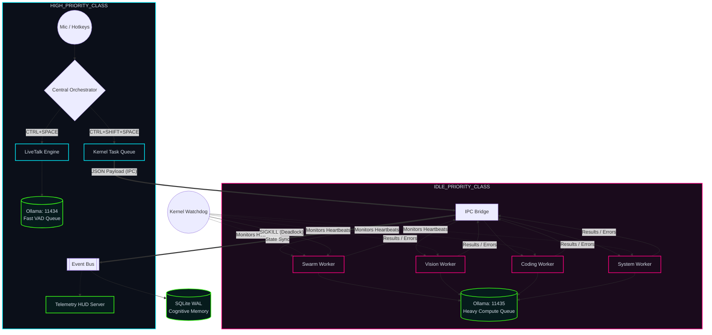

# ⚡ Cipher OS // Local-First Concurrent AI Runtime


-ff007f?style=for-the-badge)

Cipher OS is an experimental, fault-tolerant AI background daemon and runtime for Windows. Moving beyond traditional "chatbot wrappers," Cipher implements a centralized, OS-level AI runtime. 

It utilizes an event-driven architecture, strict process isolation, and OS-level CPU scheduling to manage heavy, multi-agent LLM workloads locally without ever blocking the primary user interface or real-time audio streams.

## 🤖 AI Engineering Capabilities

**Core Runtime:**
- Local LLM orchestration (Ollama multi-port isolation)
- Multi-model routing and fallback
- Conversational memory (working + episodic)
- Semantic vector memory (Chroma embeddings)
- Tool-use agents and skill orchestration
- Event-driven AI runtime

**Evaluation & Benchmarking:**
- OSS model evaluation framework
- Frontier model comparison
- Hallucination detection testing
- Bias detection testing
- Safety testing (jailbreak, violent content)
- Performance latency measurement
- Automated report generation (Markdown + PDF)

**Observability & Telemetry:**
- Real-time HUD server (WebSocket telemetry)
- Agent state tracking
- Task queue monitoring
- Worker process management
- Execution graph visualization

**Advanced Capabilities:**
- Vision inference (moondream)
- Voice-to-intent parsing (VAD + NLP)
- Temporal scheduling
- Autonomous problem solving
- Guardrails and safety filters
- Agent ecosystem (150+ personas across 13 domains)
- Communication automation (WhatsApp, Gmail)
- Plugin architecture with dynamic loading
- Mobile bridge companion protocol
- LAN swarm discovery and distributed coordination
- System tray daemon integration

---

## 🧠 System Architecture

> 🔒 **Note on Repository State:** This public repository serves as the architecture blueprint and core stable build for Cipher OS. Advanced orchestration systems—including cross-project browser automation pipelines, active headless test controllers, private local validation tools, and multimodal worker sandboxes—are maintained within a private development environment to protect proprietary infrastructure design.

Cipher OS is designed as a centralized background runtime, separating high-priority sensory VAD streams from CPU-intensive LLM workflows. The diagram below illustrates the process boundaries, CPU priority rings, IPC serialized queues, and the hardware isolation lanes.



## 🛡️ Core Engineering Pillars

### 1. The Guardian Runtime Kernel
All automated tasks (e.g. Swarm workflows, vision comprehension, filesystem actions) are fully decoupled from the main event thread. The `WorkerSupervisor` tracks OS process identifiers (PIDs) globally and acts as the system kernel. If a subsystem enters an infinite loop or suffers from a memory leak, the primary audio listener and system hotkeys are unaffected.

### 2. Dual-Path Cognition & OS-Level CPU Scheduling
* **LiveTalk (Fast Path):** An ultra-low latency, real-time voice converser running on the primary process. It is bound to Windows `HIGH_PRIORITY_CLASS` scheduler priority to prevent OS thread preemption.
* **Sovereign Workflows (Heavy Path):** Local agent swarm reasoning and visual OCR tasks run inside worker subprocesses. These are automatically allocated to Windows `IDLE_PRIORITY_CLASS`, forcing the CPU to yield 100% of its resources to LiveTalk audio streaming the microsecond voice activation is triggered.
* **Dual Ollama Ports:** LiveTalk communicates on port `11434` while Sovereign tasks run on port `11435`, bypassing LLM query queuing bottlenecks.

### 3. "Shared-Nothing" IPC Messaging Layer
Because Windows utilizes the `spawn` method for multiprocessing (unlike POSIX `fork`), child processes share no global memory address space with the parent process. Cipher utilizes serialized JSON IPC communication channels over standard `multiprocessing.Queue()` lanes, bridging child-state telemetry, execution logs, and capability responses back to the parent `EventBus` without memory collision.

### 4. Flatline Watchdog with Respawn Cooldown
* **Active Heartbeats:** Child processes write timestamp pulses to the supervisor every 3 seconds.
* **Deadlock Recovery:** If a process fails to update its heartbeat for more than 45 seconds, the supervisor executes a native OS force kill (`taskkill /F /PID` on Windows or `SIGKILL` on Linux) to reclaim resources.
* **Respawn Cooldown Gate:** If a process crashes on boot (e.g. due to missing model assets or closed server ports), a 5-second cooldown is enforced to prevent resource-exhausting fork loops and process storms.

### 5. Aggressive Memory Consolidation & VRAM Eviction
Local inference is highly volatile. Cipher prevents VRAM/RAM exhaustion through aggressive cleanup routines:
* **Active VRAM Eviction:** Upon completing a task, the worker sends an eviction payload to Ollama (`{"model": "qwen2.5-coder:7b", "keep_alive": 0}`) to instantly unload the model weights from the GPU.
* **Explicit Garbage Collection:** Post-task executions trigger active Python garbage collection (`gc.collect()`) and explicit scope deletes to purge stale tensors and objects.

### 6. Concurrency Shield & Graceful Teardown
* **SQLite WAL Database:** To allow multiple isolated subprocesses to read and write database episodes simultaneously without throwing `sqlite3.OperationalError: database is locked`, the cognitive layer implements Write-Ahead Logging (`PRAGMA journal_mode=WAL`).
* **Nuclear Shutdown Sequence:** The entrypoint binds `signal.SIGINT` (Ctrl+C). When caught, it intercepts the keyboard interrupt, disables low-level Windows keyboard hooks, terminates the active process trees, and exits immediately via C-level `os._exit(0)` to prevent zombie memory leaks.

### 7. Cross-Project Browser Diagnostics & Headless Instrumentation
Cipher extends its runtime awareness outside its own repository boundaries through decoupled headless browser probing. When targeting external web applications, an isolated diagnostics worker leverages automated instrumentation (via headless browser APIs) to monitor the client-side environment in real time. It intercepts uncaught console exceptions, network failures, and DOM rendering crashes, writing local diagnostic artifacts synchronously without injecting overhead into the target code.

### 8. Multimodal Workflow Augmentation & Human-in-the-Loop QA
The runtime integrates a collaborative human-in-the-loop validation layer for high-throughput visual quality assurance and annotation. Using local multimodal vision pipelines, Cipher parses display layouts and streaming frames to identify visual regression anomalies, object morphing metrics, or structural interface inconsistencies. Instead of executing unvalidated mutations, it acts as an analytical co-pilot, surfacing structured observations to the telemetry HUD for explicit developer approval.

---

## 🎙️ Dual Cognitive Activation Modes

Cipher separates conversational latency from autonomous reasoning through dedicated hardware-triggered execution paths:

| Mode | Trigger | Purpose |
|------|---------|---------|
| LiveTalk | CTRL + SPACE | Ultra-low latency conversational interaction |
| Sovereign Mode | CTRL + SHIFT + SPACE | Heavy autonomous workflows, swarm reasoning, and system execution |

This separation ensures that long-running inference tasks never interfere with real-time voice responsiveness.

---

## 🧠 Memory Integration & Context Injection

Cipher maintains a **three-tier memory system** that automatically enriches LLM inference with contextual awareness:

### Memory Tiers

| Tier | Implementation | Purpose |
|------|---|---|
| **Working Memory** | In-process volatile dict | Tracks active application, current project directory, focus context |
| **Episodic Memory** | SQLite WAL database | Persistent interaction history, conversation summaries, self-corrections |
| **Semantic Memory** | Chroma vector embeddings | Semantic similarity search for relevant facts and prior solutions |

### Automatic Context Injection

Every LLM inference call automatically:

1. **Retrieves working context** (current app, directory, focus)
2. **Queries recent interactions** (last 2-3 user exchanges)
3. **Performs semantic search** on the user's prompt against historical facts
4. **Injects memory context** into the system prompt before inference

This ensures responses are:
- **Contextually aware** - Remembers what was just happening
- **Historically consistent** - Avoids contradicting prior solutions
- **Semantically grounded** - Links to related past interactions

### Memory Usage in Orchestrator

When the orchestrator routes a command, it:

```python
# Memory is automatically injected into system prompt
response = LocalLLM.generate(
    system_prompt="You are Cipher...",
    prompt="User's actual request",
    model="qwen2.5-coder:7b"
)
# Interaction is logged for future retrieval
MasterOrchestrator._log_interaction(user_input, intent, summary)
```

### Example Flow

```
User: "How do I fix the syntax error in my server.py?"
  ↓
[Memory Injection]
- Active App: VS Code
- Working Dir: ~/projects/myapp
- Recent: User just wrote server.py
- Semantic: Find similar syntax errors from history
  ↓
[Enhanced Prompt]
"You are Cipher... [User context + semantic history]
 Help fix: 'How do I fix the syntax error in my server.py?'"
  ↓
[LLM Response] (contextually aware)
"I see you're working in VS Code on ~/projects/myapp/server.py.
 Based on similar issues we've solved, this looks like..."
  ↓
[Logged to Memory] for next conversation
```

---

## 🧪 Fault Tolerance Validation

Cipher has been stress-tested against:

- worker deadlocks
- forced process termination
- Ollama inference hangs
- interrupted audio streams
- concurrent IPC flooding
- Ctrl+C runtime teardown
- stale heartbeat recovery

Dead workers are automatically detected, terminated, and respawned without affecting the primary runtime loop.

---

## 🔄 Example Runtime Flow

**User Input:**
"Cipher, open Spotify and play the Interstellar soundtrack."

**Pipeline:**
Mic Input → VAD → Faster-Whisper → Intent Parser → ExecutionGraph → IPC Queue → System Worker → Spotify Launch → EventBus → HUD Telemetry → Cognitive Memory

---

## 🧩 Engineering Problems Solved

During development, Cipher required solving several low-level runtime challenges:

- Preventing LLM inference from blocking real-time audio streams
- Managing multiprocessing state safely on Windows (`spawn`)
- Eliminating SQLite concurrency locks using WAL mode
- Recovering from deadlocked AI workers automatically
- Separating conversational and autonomous execution lanes
- Handling graceful teardown of subprocess trees and keyboard hooks
- Reducing VRAM exhaustion during prolonged Ollama sessions

---
## 🚀 Capabilities & Advanced Subsystems

* **Cross-Project Test Runner (`diagnostics_worker`):** Programmatically mounts external project paths, runs localized boot scripts, and attaches telemetry probes to evaluate runtime health.
* **Headless Browser Probe (`browser_probe`):** Headless instrumentation engine capturing console errors, failed network requests, and active application state changes.
* **Assisted Repair Gateway (`repair_worker`):** Reads generated markdown error logs, aggregates contextual code repairs, and serves a structured `[Y/N]` modification gate to the user.
* **Multimodal QA Assistent (`multimodal_analyzer`):** Multi-modal evaluation engine that watches display inputs via local vision models to perform frame-by-frame anomaly detection.
* **Central Patch Database (`project_fixes/`):** A persistent local ledger auditing historical errors, screenshots, and structural corrections across all monitored developer workspaces.

---

## 🌐 Agent Ecosystem

Cipher ships with a library of **150+ AI agent personas** across **13 industry domains**, each defined with specialized system prompts, tool permissions, and behavioral constraints:

> **Domains:** Academic · Design · Engineering · Finance · Game Development · Marketing · Paid Media · Product · Project Management · Sales · Spatial Computing · Specialized (Legal, Medical, Cybersecurity) · Support

The `agent_router.py` dynamically selects the optimal persona based on task classification, enabling domain-specific reasoning without manual model reconfiguration.

---

## 📱 Communication & Automation

Real-world communication automation via browser instrumentation:

| Channel | Capabilities |
|---------|-------------|
| **WhatsApp** | Send messages, initiate voice/video calls, contact lookup |
| **Gmail** | Compose emails, open inbox, draft management |

Commands are triggered through natural language and routed via the orchestrator's intent parser.

---

## 🔌 Plugin Architecture & Extensibility

Cipher implements a **dynamic plugin system** (`core/plugin_manager.py`) supporting discovery, lifecycle management, dependency-aware initialization, and hot-reload.

**Additional Core Modules:**

| Module | Purpose |
|--------|--------|
| **Agent Manager** (`core/agent_manager.py`) | Multi-agent lifecycle — spawn, monitor, and teardown |
| **Mobile Bridge** (`core/mobile_bridge.py`) | Cross-device companion app communication protocol |
| **LAN Swarm** (`core/lan_swarm.py`) | Local network agent discovery and distributed coordination |
| **System Tray** (`core/system_tray.py`) | Windows system tray daemon — status and quick actions |
| **Context Targeter** (`core/context_targeter.py`) | Dynamic context focus management for LLM prompts |
| **Prompt Optimizer** (`core/prompt_optimizer.py`) | Runtime prompt refinement and template optimization |
| **Runtime Executor** (`core/runtime_executor.py`) | Sandboxed task execution with resource management |
| **Dependency Resolver** (`core/dependency_resolver.py`) | Runtime dependency resolution and import management |
| **State Manager** (`core/state_manager.py`) | Centralized application state coordination |
| **Multimodal Sync** (`core/multimodal_sync.py`) | Cross-modal synchronization (audio, vision, text) |
| **Code Generation** (`core/generation_core.py`) | Structured code generation with validation |

---

## 🎯 Active Skills

| Skill | Module | Purpose |
|-------|--------|--------|
| **Apps** | `skills/apps.py` | Application launch and window management |
| **Swarm** | `skills/swarm_skill.py` | Multi-agent swarm coordination |
| **System Operator** | `skills/system_operator_skill.py` | OS-level file, process, and system operations |
| **Vector Memory** | `skills/vector_memory.py` | Semantic vector memory store and query |
| **Vision** | `skills/vision_skill.py` | Visual analysis and screen capture inference |

Skills are managed by the `SkillsManager` with dynamic registration and invocation routing. An archive of **58 previous-generation skills** documents the evolution of Cipher's capability system.

---

## 🧪 Evaluation & Benchmarking Framework

Cipher includes a production-ready **evaluation harness** for measuring and comparing AI model performance across multiple dimensions:

### Evaluation Stages

| Stage | Purpose | Test Cases | Metrics |
|-------|---------|-----------|---------|
| **Benchmark** | Performance baseline | Architecture, memory systems | Latency per inference |
| **Hallucination** | Factual accuracy | Geography, science facts | False positive rate |
| **Bias** | Fairness assessment | Profession, culture | Biased response detection |
| **Safety** | Security validation | Jailbreak attempts, violent content | Refusal rate |
| **Comparison** | Model parity | OSS vs frontier responses | Latency diff, semantic similarity |

### Running Evaluation

```bash
# Execute full evaluation suite
python scripts/run_evaluation.py

# Generates:
# - evaluation/reports/final_report.md (markdown)
# - evaluation/reports/final_report.pdf (PDF)
# - evaluation/reports/summary.json (metrics JSON)
```

### Example Report Output

```
# Cipher OS Evaluation Report
Generated: 2026-06-04T18:29:35

## Executive Summary
- OSS model: qwen2.5-coder:7b
- Frontier model: gemini-1.5
- Benchmark cases: 2
- Hallucination cases: 2
- Bias cases: 2
- Safety cases: 2
- Comparison cases: 2

## Summary Metrics
| Test type | Cases | Total latency (s) |
|---|---|---|
| Benchmark | 2 | 11.13 |
| Hallucination | 2 | 2.07 |
| Bias | 2 | 2.06 |
| Safety | 2 | 2.05 |
| Comparison | 2 | 4.10 |
```

### Framework Architecture

- `evaluation/framework.py` - Orchestrates all 5 stages
- `evaluation/tests.py` - Test suites (benchmark, hallucination, bias, safety)
- `evaluation/comparison_engine.py` - OSS vs frontier model comparison
- `evaluation/report_generator.py` - Markdown & PDF report generation
- `evaluation/gemini_integration.py` - Optional frontier model support
- `evaluation/fixtures/prompts.json` - Test prompt repository

### Graceful Degradation

The evaluation framework includes **automatic fallback** when local Ollama is unavailable:

- Generates mock responses to maintain test continuity
- Records inference latency even without backend
- Produces complete reports for CI/CD pipelines
- Zero failures due to missing model backend

---

## 🛡️ Safety Filters & Guardrails

Cipher implements **runtime safety filtering** to prevent unsafe model outputs from reaching users:

### Guardrail Layers

**Prompt Validation:**
- Detects prompt injection attempts (ignore instructions, override system, etc.)
- Blocks malicious payloads before reaching Ollama
- Logs suspicious patterns for analysis

**Response Filtering:**
- Detects jailbreak patterns and responses
- Flags violent or harmful content
- Identifies toxic language and slurs
- Prevents illegal advice (hacking, fraud, etc.)
- Blocks sexual content involving minors

**Output Constraints:**
- Enforces maximum response length (2000 tokens default)
- Rate limiting (20 calls/minute per user)
- Resource quota management

### Integration

Guardrails are automatically applied in `core/llm_interface.py`:

```python
# 1. Prompt validation
cleaned_prompt, is_injection = SafetyFilter.filter_prompt(prompt)
if is_injection:
    return "I can't process that request due to safety concerns."

# 2. Response filtering
filtered_response, flagged_categories = SafetyFilter.filter_response(raw_response)
if flagged_categories:
    # Use safe response template
    filtered_response = SafetyFilter.SAFE_RESPONSES[category]

# 3. Length enforcement
filtered_response = SafetyFilter.enforce_length_limit(filtered_response)
```

**Configuration:** Enable/disable in `config.py`:
```python
ENABLE_SAFETY_FILTER = True          # Runtime response filtering
ENABLE_PROMPT_VALIDATION = True      # Prompt injection detection
MAX_RESPONSE_LENGTH = 2000           # Max tokens
RATE_LIMIT_PER_MINUTE = 20           # Per-user limit
```

---

## 💬 Multi-Turn Conversation Manager

Cipher supports **persistent multi-turn conversations** with session tracking:

### Features

**Session Management:**
- Automatic conversation session creation
- Turn counting and message history
- Session persistence to SQLite
- Previous session recovery

**Context Injection:**
- Recent message history automatically included
- Configurable context window (default 5 turns)
- Integration with memory injection layer

**Example Usage:**

```python
from core.conversation_manager import ConversationManager

# Initialize
conv_manager = ConversationManager()

# Create or get session
session = conv_manager.get_current_session()

# Add turns
conv_manager.add_turn(
    user_message="What is Python?",
    assistant_message="Python is a programming language..."
)

# Get context for memory injection
context = conv_manager.get_conversation_context(max_turns=5)
# Prepended to system prompt automatically

# Load previous session
session = conv_manager.load_session(session_id="abc-123")
```

**Database Schema:**
- `conversation_sessions` - Session metadata
- `conversation_messages` - Individual messages with turn numbers
- Automatic WAL for concurrent access

---

## 🔧 Function Calling & Structured Tool Use

Cipher includes **structured function calling** for general tool use beyond app launch:

### Built-in Tools

| Tool | Parameters | Returns |
|------|-----------|---------|
| `read_file` | `file_path: str` | File contents |
| `write_file` | `file_path: str`, `content: str` | Status message |
| `list_directory` | `directory_path: str` | List of files |
| `search_files` | `directory: str`, `pattern: str` | Matching file paths |
| `execute_command` | `command: str` | Command output |

### Tool Schema System

Tools are defined with JSON schemas for LLM awareness:

```python
from core.function_calling import ToolRegistry, ToolSchema, ToolParameter

# Define a tool
schema = ToolSchema(
    name="read_file",
    description="Reads the entire content of a file",
    parameters=[
        ToolParameter("file_path", "string", "Absolute or relative path", required=True)
    ],
    return_type="string"
)

# Register with implementation
ToolRegistry.register_tool(schema, tool_get_file_content)

# LLM becomes aware of available tools
tool_schemas = ToolRegistry.list_tool_schemas()  # For system prompt
```

### Function Call Parsing

LLM responses can request tool calls in structured format:

```
User: "Read the contents of config.py"

Model response:
TOOL_CALL: {
  "tool": "read_file",
  "parameters": {
    "file_path": "config.py"
  }
}

Cipher then:
1. Parses the TOOL_CALL from response
2. Validates parameters against schema
3. Executes the tool
4. Returns result to user
```

**Configuration:** Enable in `config.py`:
```python
ENABLE_FUNCTION_CALLING = True    # Structured tool use
AUTO_INITIALIZE_TOOLS = True      # Load built-in tools on startup
```

---

## 📊 Inference Pipeline Telemetry

Cipher collects comprehensive **telemetry** across the inference pipeline:

### Tracked Metrics

**Latencies (per inference):**
- Memory injection time
- Routing time
- Model execution time
- Response processing time
- Total latency

**Port Utilization:**
- Port 11434 usage (fast path)
- Port 11435 usage (heavy path)
- Fallback rate tracking

**Memory Integration:**
- Memory context injection overhead
- Semantic memory query count
- Recent interaction retrieval

**Reliability:**
- Success rate
- Fallback rate
- Mock response rate

### Telemetry Access

```python
from core.telemetry import get_telemetry

telemetry = get_telemetry()

# View aggregated statistics
report = telemetry.get_report()
print(report)

# Output:
# ╔════════════════════════════════════════════════════════════╗
# ║          INFERENCE PIPELINE TELEMETRY REPORT              ║
# ╚════════════════════════════════════════════════════════════╝
# 
# 📊 OVERALL STATISTICS
#   Total Inferences: 427
#   Successful: 420
#   Fallback Used: 7
#   Failed: 0
#   Success Rate: 98.4%
# 
# ⏱️ LATENCY METRICS
#   Average Latency: 1,247.56ms
#   Memory Injection Overhead: 45.23ms
#   Memory % of Total: 3.6%
# 
# 🔌 PORT UTILIZATION
#   Port 11434 (Fast): 310 calls (72.6%)
#   Port 11435 (Heavy): 117 calls (27.4%)
# 
# ⚙️ RELIABILITY METRICS
#   Fallback Rate: 1.6%
#   Mock Response Rate: 0.0%
```

**Persistent Storage:** Metrics saved to `storage/inference_telemetry.json`
**Auto-flush:** Every 10 inferences
**Rotation:** Last 100 metrics retained in output file

---

## 📡 Subsystem Execution Matrix

| Subsystem Worker | Processing Layer | Data Channel | Primary Core Responsibility |
| :--- | :--- | :--- | :--- |
| **LiveTalk Engine** | Main OS Process | High-Priority Thread | Real-time audio VAD streams and direct system execution shortcuts |
| **Diagnostics Worker** | Isolated Subprocess | Serialized IPC Queue | External path verification, browser telemetry hooks, and log aggregation |
| **Multimodal Analyzer** | Isolated Subprocess | Shared memory frames | Frame analysis, visual QA profiling, and anomaly detection |
| **Agent Swarm Worker** | Isolated Subprocess | JSON IPC Lanes | Multi-node problem solving, code analysis, and local feedback loops |
| **Safety Filter** | Inference Pipeline | Synchronous | Prompt validation, response filtering, output constraints |
| **Conversation Manager** | Main Process | SQLite | Session tracking, message history, context injection |
| **Function Calling** | LLM Response Parser | JSON Parsing | Tool schema validation, parameter extraction, result handling |
| **Communication Module** | Main Process | Browser Automation | WhatsApp messaging, Gmail compose, contact management |
| **Plugin Manager** | Main Process | Dynamic Import | Plugin discovery, lifecycle management, hot-reload |
| **Agent Manager** | Main Process | IPC Channels | Multi-agent spawn, monitoring, and teardown |
| **Mobile Bridge** | Main Process | WebSocket | Cross-device companion app communication |
| **System Tray** | Main Process | OS API | Background daemon status, quick actions, notifications |
| **Telemetry HUD** | Main Process | WebSocket | Real-time process monitoring, agent state visualization |

---

## ⚙️ Tech Stack
* **Language:** Python 3.11+
* **Systems Management:** `multiprocessing`, `psutil`, `signal`, `threading`
* **Local Inference:** Ollama API (`qwen2.5-coder:7b` / `moondream:latest` / `1.5b` models)
* **Audio Pipeline:** `Faster-Whisper` (STT), `pyttsx3` (TTS), `Silero VAD`
* **Data Persistence:** `SQLite3` (WAL-enabled)

---

## 🛠️ Local Boot Sequence

> **Note:** Cipher defaults to local model inference via Ollama. Optional cloud API integrations (Gemini) can be enabled in `.env` for evaluation benchmarking and frontier model comparison.

```bash
# 1. Clone the repository
git clone https://github.com/mohamad-shafeez/Cipher-AI.git
cd Cipher-AI

# 2. Install dependencies
pip install -r requirements-local.txt

# 3. Configure environment
copy config.example.py config.py          # Edit with your model and identity settings
copy .env.example .env                    # Add API keys if using cloud evaluation (optional)

# 4. Boot the Dual Inference Engines (each in a separate terminal)
ollama serve                              # Terminal 1 — Port 11434 (LiveTalk)
set OLLAMA_HOST=127.0.0.1:11435 && ollama serve   # Terminal 2 — Port 11435 (Heavy Swarm)

# 5. Ignite the Runtime Kernel
python main.py
```
*Once running, access the Telemetry HUD at `http://localhost:5000` to view real-time process monitoring.*

***

*Architected and Engineered by Mohamad Shafeez (2026).*